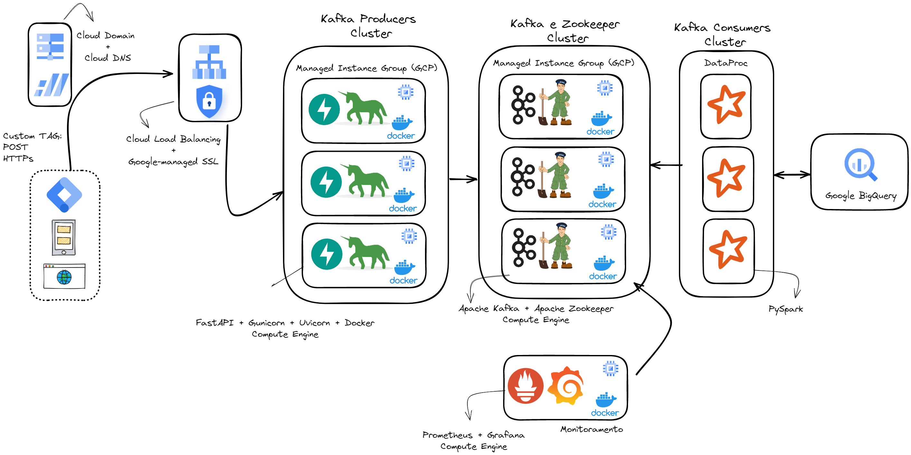

# Stargate 2.0

<div align="center">
	
</div>
<div align="center">
    
    
    
	
</div>

### 🚧 Documentação em construção

O Stargate possibilita a consolidação de dados no BigQuery de maneira mais rápida que o usual (a tabela intraday do Google Analytics é exportada para o BigQuery em intervalos com horas de diferença), permitindo que os dados de navegação gerados nos sites e aplicativos sejam consumidos em um intervalo de tempo significativamente menor (o Stargate consolida os dados no BigQuery em questão de minutos).

## Como funciona?

1. O Stargate é iniciado através de uma requisição HTTPS do tipo POST com o dataLayer no body da requisição vinda do GTM, para um endpoint criado em uma api no framework web FastAPI escrita em Python.

2. Essa api, hospedada em um Compute Engine no GCP, funciona com um servidor HTTP WSGI chamado Gunicorn, responsável por distribuir as requisições em workers ASGI chamado Uvicorn.

3. O endpoint da API instância um Producer de Kafka, que irá escrever as mensagens em um tópico criado dentro dos servidores (ou brokers) no cluster do Apache Kafka. Esses brokers de Kafka são gerenciados por servidores (ou nodes) chamado de Apache Zookeeper, onde para cada broker de Kafka, terá um node de Zookeeper dentro do mesmo Compute Engine.

4. Um cluster máquinas no DataProc rodando uma job de Apache Spark, irá ser responsável em ler e efetuar as transformações/processamentos necessários dos os dados do tópico do Kafka em streaming através de sua biblioteca nátiva Structured Streaming.

5. Após ler, transformar e processar os dados, o Spark será o responsável por escrever os dados dentro do BigQuery.



## Principais propostas de valor

<!-- - Independência de qualquer programa para a abertura das planilhas durante o processo de parametrização, o que comumente compromete a performance pelo uso extensivo de fórmulas.
- Possibilidade do uso da API em planilhas, externalizando o processamento para uma transformação puramente sobre os dados.Controle de permissões com 3 níveis, cada qual incluindo os seguintes: Controle de **acessos**, edição de **configurações**, realização da **parametrização**.
- Os acessos podem ser divididos em grupos ou projetos, para que por exemplo diferentes agências possam todas ter seu nível de configuração, mas apenas para suas próprias campanhas.
- Escalabilidade de uso por suportar grandes tamanhos de arquivo e histórico.
-->

### 💻 Produtos do GCP

O Stargate pode ser implementado em diferentes provedores de nuvem ou em ambientes on-premise. Listaremos aqui sugestões de serviços do GCP que podem ser utilizados para complementar a infraestrutura da API.

- Compute Engine
- Managed Instance Group
- DataProc
- Cloud Load Balancing
- Cloud DNS

## 🚀 Instalação

Clone o projeto do github para sua máquina local

```console
git clone https://github.com/DP6/stargate.git
```

### Instalação GCP - via Terraform

#### Pré-requisitos

1. [Google Cloud SDK](https://cloud.google.com/sdk/docs/install?hl=pt-br);
2. [Terraform](https://www.terraform.io/);
3. Habilitar o Compute Engine, Managed Instance Group, DataProc, Cloud Load Balancing, Cloud DNS, Firewall Rules (necessário ter um billing ativo), no GCP;
4. Criar o arquivo **gcp_key_terraform.json** contendo a chave json de uma conta de serviço GCP com as permissões necessárias para as subidas dos serviços via terraform;

#### Passos

1. Preencha corretamente o arquivo variables.tf com informações necessárias do projeto;

2. Execute os seguintes comandos de Terraform:
```
terraform init
terraform plan
terraform apply
```

## Requirements

| Name | Version |
|------|---------|
| <a name="requirement_google"></a> [google](#requirement\_google) | ~> 4.31.0 |

## Providers

| Name | Version |
|------|---------|
| <a name="provider_archive"></a> [archive](#provider\_archive) | 2.2.0 |
| <a name="provider_google"></a> [google](#provider\_google) | 4.31.0 |

## Modules

No modules.

## Resources

| Name | Type |
|------|------|
| [google_bigquery_dataset.dataset](https://registry.terraform.io/providers/hashicorp/google/latest/docs/resources/bigquery_dataset) | resource |
| [google_compute_backend_service.fastapi-kafka-producer-backend-service](https://registry.terraform.io/providers/hashicorp/google/latest/docs/resources/compute_backend_service) | resource |
| [google_compute_firewall.fastapi_8000](https://registry.terraform.io/providers/hashicorp/google/latest/docs/resources/compute_firewall) | resource |
| [google_compute_firewall.kafka_broker_29092_jmx_8080](https://registry.terraform.io/providers/hashicorp/google/latest/docs/resources/compute_firewall) | resource |
| [google_compute_firewall.prometheus_9090_grafana_3000](https://registry.terraform.io/providers/hashicorp/google/latest/docs/resources/compute_firewall) | resource |
| [google_compute_global_address.fastapi-kafka-stargate-address](https://registry.terraform.io/providers/hashicorp/google/latest/docs/resources/compute_global_address) | resource |
| [google_compute_global_forwarding_rule.fastapi-kafka-frontend-lb](https://registry.terraform.io/providers/hashicorp/google/latest/docs/resources/compute_global_forwarding_rule) | resource |
| [google_compute_global_forwarding_rule.fastapi-kafka-frontend-lb-forwarding-rule](https://registry.terraform.io/providers/hashicorp/google/latest/docs/resources/compute_global_forwarding_rule) | resource |
| [google_compute_health_check.healthcheck-lb](https://registry.terraform.io/providers/hashicorp/google/latest/docs/resources/compute_health_check) | resource |
| [google_compute_health_check.healthcheck-mig](https://registry.terraform.io/providers/hashicorp/google/latest/docs/resources/compute_health_check) | resource |
| [google_compute_instance.kafka_test_and_monitoring_instance](https://registry.terraform.io/providers/hashicorp/google/latest/docs/resources/compute_instance) | resource |
| [google_compute_instance_group_manager.fastapi_kafka_producer_instance_group_manager](https://registry.terraform.io/providers/hashicorp/google/latest/docs/resources/compute_instance_group_manager) | resource |
| [google_compute_instance_group_manager.kafka_zookeeper_instance_group_manager](https://registry.terraform.io/providers/hashicorp/google/latest/docs/resources/compute_instance_group_manager) | resource |
| [google_compute_instance_template.fastapi_kafka_producer_instance_template](https://registry.terraform.io/providers/hashicorp/google/latest/docs/resources/compute_instance_template) | resource |
| [google_compute_instance_template.kafka_zookeeper_instance_template](https://registry.terraform.io/providers/hashicorp/google/latest/docs/resources/compute_instance_template) | resource |
| [google_compute_managed_ssl_certificate.fastapi-kafka-stargate-ssl](https://registry.terraform.io/providers/hashicorp/google/latest/docs/resources/compute_managed_ssl_certificate) | resource |
| [google_compute_project_metadata.project_metadata](https://registry.terraform.io/providers/hashicorp/google/latest/docs/resources/compute_project_metadata) | resource |
| [google_compute_target_http_proxy.fastapi-kafka-stargate-frontend-lb-target-proxy](https://registry.terraform.io/providers/hashicorp/google/latest/docs/resources/compute_target_http_proxy) | resource |
| [google_compute_target_https_proxy.fastapi-kafka-stargate-lb-target-proxy](https://registry.terraform.io/providers/hashicorp/google/latest/docs/resources/compute_target_https_proxy) | resource |
| [google_compute_url_map.fastapi-kafka-frontend-lb](https://registry.terraform.io/providers/hashicorp/google/latest/docs/resources/compute_url_map) | resource |
| [google_dataproc_cluster.stargate_cluster_stage](https://registry.terraform.io/providers/hashicorp/google/latest/docs/resources/dataproc_cluster) | resource |
| [google_dns_managed_zone.fastapi-kafka-stargate-dns-com](https://registry.terraform.io/providers/hashicorp/google/latest/docs/resources/dns_managed_zone) | resource |
| [google_dns_record_set.fastapi-kafka-stargate-com](https://registry.terraform.io/providers/hashicorp/google/latest/docs/resources/dns_record_set) | resource |
| [google_storage_bucket.bucket_stargate](https://registry.terraform.io/providers/hashicorp/google/latest/docs/resources/storage_bucket) | resource |
| [google_storage_bucket_object.static_spark_job](https://registry.terraform.io/providers/hashicorp/google/latest/docs/resources/storage_bucket_object) | resource |
| [google_storage_bucket_object.static_spark_start_script](https://registry.terraform.io/providers/hashicorp/google/latest/docs/resources/storage_bucket_object) | resource |
| [google_storage_bucket_object.static_stargate_src](https://registry.terraform.io/providers/hashicorp/google/latest/docs/resources/storage_bucket_object) | resource |
| [archive_file.zip_code](https://registry.terraform.io/providers/hashicorp/archive/latest/docs/data-sources/file) | data source |

## Inputs

| Name | Description | Type | Default | Required |
|------|-------------|------|---------|:--------:|
| <a name="input_allowed_hosts"></a> [allowed\_hosts](#input\_allowed\_hosts) | Insira aqui o domínio do site | `string` | `"['www.google.com', 'https://www.google.com']"` | yes |
| <a name="input_bigquery_dataset"></a> [bigquery\_dataset](#input\_bigquery\_dataset) | Insira o nome do dataset a ser criado no Big Query | `string` | `"stargate_v2"` | yes |
| <a name="input_bucket_name"></a> [bucket\_name](#input\_bucket\_name) | Insira o nome do bucket | `string` | `"bucket_stargate"` | yes |
| <a name="input_fastapi_disk_size"></a> [fastapi\_disk\_size](#input\_fastapi\_disk\_size) | Insira a capacidade de disco de cada máquina da FastAPI | `number` | `10` | yes |
| <a name="input_fastapi_disk_type"></a> [fastapi\_disk\_type](#input\_fastapi\_disk\_type) | Insira a capacidade de disco de cada máquina da FastAPI | `string` | `"pd-ssd"` | yes |
| <a name="input_fastapi_domain"></a> [fastapi\_domain](#input\_fastapi\_domain) | Insira o domínio criado para a FastAPI | `list` | <pre>[<br>  "fastapi-kafka-stargate-v2.com"<br>]</pre> | yes |
| <a name="input_fastapi_firewall_rule_name"></a> [fastapi\_firewall\_rule\_name](#input\_fastapi\_firewall\_rule\_name) | Insira o nome da tag da regra de firewall das portas da FastAPI | `string` | `"fastapi-8000"` | yes |
| <a name="input_fastapi_firewall_rule_port"></a> [fastapi\_firewall\_rule\_port](#input\_fastapi\_firewall\_rule\_port) | Insira as portas da regra de firewall da FastAPI | `list` | <pre>[<br>  "8000"<br>]</pre> | yes |
| <a name="input_fastapi_machine_number"></a> [fastapi\_machine\_number](#input\_fastapi\_machine\_number) | Insira a quantidade de máquinas do cluster da FastAPI | `number` | `1` | yes |
| <a name="input_fastapi_machine_type"></a> [fastapi\_machine\_type](#input\_fastapi\_machine\_type) | Insira o tipo de máquinas do cluster da FastAPI | `string` | `"e2-medium"` | yes |
| <a name="input_fastapi_name_prefix"></a> [fastapi\_name\_prefix](#input\_fastapi\_name\_prefix) | Insira o prefixo do nome das máquinas e do cluster da FastAPI | `string` | `"fastapi-kafka-producer"` | yes |
| <a name="input_fastapi_network_tags"></a> [fastapi\_network\_tags](#input\_fastapi\_network\_tags) | Insira a lista de tags das regras de Firewall de cada máquina de Kafka | `list` | <pre>[<br>  "http-server",<br>  "https-server",<br>  "fastapi-8000",<br>  "allow-health-check"<br>]</pre> | yes |
| <a name="input_kafka_disk_size"></a> [kafka\_disk\_size](#input\_kafka\_disk\_size) | Insira a capacidade de disco de cada máquina de Kafka | `number` | `10` | yes |
| <a name="input_kafka_disk_type"></a> [kafka\_disk\_type](#input\_kafka\_disk\_type) | Insira a capacidade de disco de cada máquina de Kafka | `string` | `"pd-ssd"` | yes |
| <a name="input_kafka_firewall_rule_name"></a> [kafka\_firewall\_rule\_name](#input\_kafka\_firewall\_rule\_name) | Insira o nome da tag da regra de firewall das portas de Kafka, JMX e Zookeeper | `string` | `"kafka-broker-29092-jmx-8080-zookeeper-2181"` | yes |
| <a name="input_kafka_firewall_rule_port"></a> [kafka\_firewall\_rule\_port](#input\_kafka\_firewall\_rule\_port) | Insira as portas da regra de firewall de Kafka, JMX e Zookeeper | `list` | <pre>[<br>  "9092",<br>  "8080",<br>  "2181"<br>]</pre> | yes |
| <a name="input_kafka_machine_number"></a> [kafka\_machine\_number](#input\_kafka\_machine\_number) | Insira a quantidade de máquinas do cluster de Kafka | `number` | `1` | yes |
| <a name="input_kafka_machine_type"></a> [kafka\_machine\_type](#input\_kafka\_machine\_type) | Insira o tipo das máquinas do cluster de Kafka | `string` | `"e2-medium"` | yes |
| <a name="input_kafka_name_prefix"></a> [kafka\_name\_prefix](#input\_kafka\_name\_prefix) | Insira o prefixo do nome das máquinas e do cluster de Kafka | `string` | `"kafka-zookeeper"` | yes |
| <a name="input_kafka_network_tags"></a> [kafka\_network\_tags](#input\_kafka\_network\_tags) | Insira a lista de tags das regras de Firewall de cada máquina de Kafka | `list` | <pre>[<br>  "http-server",<br>  "https-server",<br>  "kafka-broker-29092-jmx-8080"<br>]</pre> | yes |
| <a name="input_kafka_test_monitoring_disk_size"></a> [kafka\_test\_monitoring\_disk\_size](#input\_kafka\_test\_monitoring\_disk\_size) | Insira a capacidade de disco da máquina de Teste e Monitoramento | `number` | `10` | yes |
| <a name="input_kafka_test_monitoring_disk_type"></a> [kafka\_test\_monitoring\_disk\_type](#input\_kafka\_test\_monitoring\_disk\_type) | Insira a capacidade de disco da máquina de Teste e Monitoramento | `string` | `"pd-standard"` | yes |
| <a name="input_kafka_test_monitoring_machine_type"></a> [kafka\_test\_monitoring\_machine\_type](#input\_kafka\_test\_monitoring\_machine\_type) | Insira o tipo da máquina de Teste e Monitoramento | `string` | `"e2-medium"` | yes |
| <a name="input_kafka_test_monitoring_name_prefix"></a> [kafka\_test\_monitoring\_name\_prefix](#input\_kafka\_test\_monitoring\_name\_prefix) | Insira o prefixo do nome da máquina de Teste e Monitoramento | `string` | `"kafka-test-and-monitoring"` | yes |
| <a name="input_kafka_test_monitoring_network_tags"></a> [kafka\_test\_monitoring\_network\_tags](#input\_kafka\_test\_monitoring\_network\_tags) | Insira a lista de tags das regras de Firewall da máquina de Teste e Monitoramento | `list` | <pre>[<br>  "http-server",<br>  "https-server",<br>  "prometheus-9090-grafana-3000"<br>]</pre> | yes |
| <a name="input_kafka_topic_name"></a> [kafka\_topic\_name](#input\_kafka\_topic\_name) | Insira aqui o nome do tópico a ser usado no Kafka | `string` | `"stargate_v2.realtime"` | yes |
| <a name="input_load_balancing_name"></a> [load\_balancing\_name](#input\_load\_balancing\_name) | Insira o nome criado para o load balancing | `string` | `"fastapi-kafka"` | yes |
| <a name="input_network"></a> [network](#input\_network) | Insira a network utilizada | `string` | `"default"` | yes |
| <a name="input_project_id"></a> [project\_id](#input\_project\_id) | Insira o ID do projeto no Google Cloud Platform | `string` | `"dp6-stargate"` | yes |
| <a name="input_project_name"></a> [project\_name](#input\_project\_name) | Insira o ID do projeto no Google Cloud Platform | `string` | `"stargate"` | yes |
| <a name="input_region"></a> [region](#input\_region) | Insira a região do projeto | `string` | `"us-central1"` | yes |
| <a name="input_service_account_email"></a> [service\_account\_email](#input\_service\_account\_email) | Insira o email de uma conta de serviço no formato service-account@project-id.iam.gserviceaccount.com | `string` | `"testeterraformstargate@dp6-stargate.iam.gserviceaccount.com"` | yes |
| <a name="input_spark_disk_size"></a> [spark\_disk\_size](#input\_spark\_disk\_size) | Insira a capacidade de disco de cada máquina do Spark | `number` | `100` | yes |
| <a name="input_spark_disk_type"></a> [spark\_disk\_type](#input\_spark\_disk\_type) | Insira a capacidade de disco de cada máquina do Spark | `string` | `"pd-ssd"` | yes |
| <a name="input_spark_machine_number"></a> [spark\_machine\_number](#input\_spark\_machine\_number) | Insira a quantidade de máquinas do DataProc do Spark | `number` | `1` | yes |
| <a name="input_spark_machine_type"></a> [spark\_machine\_type](#input\_spark\_machine\_type) | Insira o tipo das máquinas do DataProc do Spark | `string` | `"n1-standard-2"` | yes |
| <a name="input_spark_name_prefix"></a> [spark\_name\_prefix](#input\_spark\_name\_prefix) | Insira o prefixo do nome das máquinas e do cluster de Kafka | `string` | `"spark"` | yes |
| <a name="input_spark_stargate_group"></a> [spark\_stargate\_group](#input\_spark\_stargate\_group) | Insira o nome do Consumer Group que o Spark Consumer será inserido no Kafka | `string` | `"spark.stargate.group"` | yes |
| <a name="input_test_monitoring_firewall_rule_name"></a> [test\_monitoring\_firewall\_rule\_name](#input\_test\_monitoring\_firewall\_rule\_name) | Insira o nome da tag da regra de firewall das portas do Prometheus e Grafana | `string` | `"prometheus-9090-grafana-3000"` | yes |
| <a name="input_test_monitoring_firewall_rule_port"></a> [test\_monitoring\_firewall\_rule\_port](#input\_test\_monitoring\_firewall\_rule\_port) | Insira as portas da regra de firewall do Prometheus e do Grafana | `list` | <pre>[<br>  "9000",<br>  "3000"<br>]</pre> | yes |
| <a name="input_zone"></a> [zone](#input\_zone) | Insira a zona do projeto | `string` | `"us-central1-a"` | yes |

## Outputs

| Name | Description |
|------|-------------|
| <a name="output_fastapi_url"></a> [fastapi\_url](#output\_fastapi\_url) | Acessar em aba anônima a documentação da FastAPI |
| <a name="output_grafana_url"></a> [grafana\_url](#output\_grafana\_url) | Acessar Grafana para acessar Dashboard de monitoramento do Kafka |
| <a name="output_prometheus_url"></a> [prometheus\_url](#output\_prometheus\_url) | Acessar Prometheus para verificar coleta de métricas do Kafka |
| <a name="output_spark_job_command"></a> [spark\_job\_command](#output\_spark\_job\_command) | Comando para startar a job de Spark |


### Instalação GCP - Manual

[Codex - Implementação na GCP - versão 2.0](https://codex.dp6.io/books/stargate/chapter/implementacao-na-gcp-versao-20)

## 🤝 Como contribuir

Pull requests são bem-vindos! Nós vamos adorar ajuda para evoluir esse modulo. Sinta-se livre para navegar por issues abertas buscando por algo que possa fazer. Caso tenha uma nova feature ou bug, por favor abra uma nova issue para ser acompanhada pelo nosso time.

### Requisitos obrigatórios

Só serão aceitas contribuições que estiverem seguindo os seguintes requisitos:

- [Padrão de commit](https://www.conventionalcommits.org/en/v1.0.0/)
- [Padrão de criação de branches](https://www.atlassian.com/br/git/tutorials/comparing-workflows/gitflow-workflow)

### Documentação

## Suporte:

**DP6 Koopa-troopa Team**

_e-mail: <koopas@dp6.com.br>_


